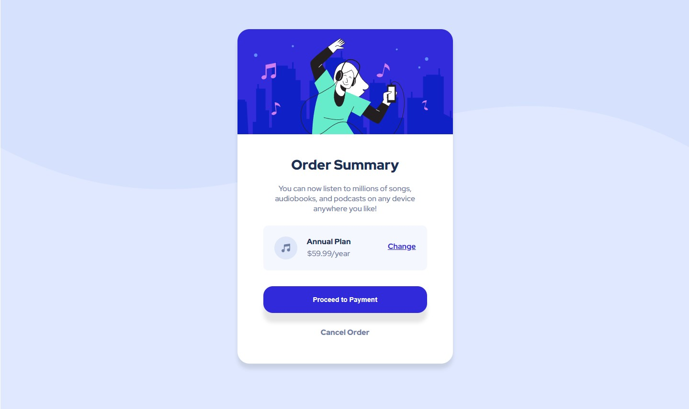

## Table of contents

- [Overview](#overview)
  - [The challenge](#the-challenge)
  - [Screenshot](#screenshot)
  - [Links](#links)
- [My process](#my-process)
  - [Built with](#built-with)
  - [What I learned](#what-i-learned)
  - [Continued development](#continued-development)
  - [Useful resources](#useful-resources)
- [Author](#author)
- [Acknowledgments](#acknowledgments)

## Overview

### The challenge

Users should be able to:

- See hover states for interactive elements

### Screenshot

### Links

- Solution URL: [Add solution URL here](https://www.frontendmentor.io/solutions/html-and-css-3ej1PIVkb)
- Live Site URL: [Add live site URL here](https://gelo29.github.io/Order_summary_component/)

## My process

As a beginner I used purely HTML and CSS, I skipped the mobile design as I still learning the Media Query

### Built with

- Semantic HTML5 markup
- CSS
- VS Code
- Photopea

### What I learned

- Basic Git
- Semantic HTML5 markup
- Basic CSS
